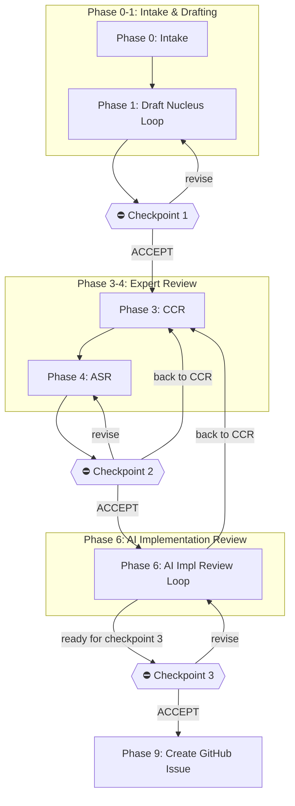

# Issue Refinement Runbook v3.4

**Purpose:** Transform a rough backlog idea into an **execution-ready GitHub issue** (feature or research). This runbook **separates refinement from implementation** and provides explicit human approval gates.

**Research note:** For research tickets, use the research-first prompts and guardrails in `issue-refinement-runbook-research-companion.md`.

**Supersedes:** `ai-session-runbook-refined-feature.md` (v1, now deprecated)

**Changelog:**

- v3.4: Migrated to steward CLI backend; working folder now uses `_workshop/` structure with symlink-based stage management; clarified inbox (no rules) → intake (standards later) → forge flow; accept single file or folder as input
- v2.3: Renamed final draft artifact to `7.10-issue-draft.md`; removed double-stop before Checkpoint 2 (Phase 5 flows directly to Checkpoint 2, revision loop only on non-acceptance)
- v2.2: Pre-CCR spikes for high-complexity (`1.30-`), strict QA KICKBACK enforcement, sizing + split analysis at Checkpoint 3 (human decision), console stats in retrospective, enhanced cold-start context for split tickets
- v2.1: Added warm start, ticket complexity, spike inheritance, checkpoint diffs, consensus CCR format, retrospective, context window tracking

---

## Quick Reference



### Checkpoints (STOP POINTS)

| Checkpoint | Shows                          | Proceeds to              |
| ---------- | ------------------------------ | ------------------------ |
| 1          | `1.20-issue-draft.md`          | Expert Review (CCR)      |
| 2          | `4.20-issue-draft-reviewed.md` | AI Implementation Review |
| 3          | `7.10-issue-draft.md`          | GitHub Issue Creation    |

### Maturity Levels

| Maturity   | Phase Range | Trigger                                         |
| ---------- | ----------- | ----------------------------------------------- |
| `raw`      | 0-1         | Initial intake and drafting                     |
| `shaped`   | 3-4         | Checkpoint 1 accepted (entering CCR)            |
| `reviewed` | 6           | Checkpoint 2 accepted (entering AI impl review) |
| `ready`    | 9           | Checkpoint 3 accepted (issue created)           |

**Maturity transitions occur at checkpoint acceptance:**

- Update the `**Maturity:**` field in the nucleus when transitioning
- Record the transition in the Version History table (the header version field is deprecated; use the table as the source of truth)
- Bump version MINOR on maturity promotion (e.g., v0.1.3 → v0.2.0)

### AI Implementation Review Loop

After Checkpoint 2, enter the **AI Implementation Review Loop**:

- **Q&A iteration:** Agent asks clarifying questions, human answers, draft updates
- **Back to CCR:** Human requests re-review (e.g., "back to CCR") → return to expert review
- **Ready:** Human signals readiness (e.g., "ready for checkpoint 3") → proceed to Checkpoint 3

---

## Session Contract

- **Mode:** Active session logging in the working folder
- **Working folder:** Always under `_workshop/5-active/3-forge/<slug>/` (via symlink to canonical `_workshop/9-items/...`)
- **Stage management:** All transitions via `steward stage <slug> <stage>` commands
- **Separation:** This runbook ends after GitHub issue creation. For implementation, use a separate runbook.
- **Determinism:** Safe defaults, no overwrites unless requested
- **Approval:** Semantic acceptance required at checkpoints (e.g., "ACCEPT", "I accept this draft", "Looks good — proceed")

---

## Artifact Naming Convention

All artifacts use stable ordering prefixes: `P.SS-<name>.md`

- `P` = phase number (0–9)
- `SS` = step number (00–99, use tens: 10, 20, 30...)

**Never renumber existing artifacts.** If inserting, use an unused `SS` value.

### Phase Numbering Note

Phases are numbered 0, 1, 3, 4, 5, 6, 9 (with gaps at 2, 7, 8). This is intentional:

- Phase numbers align with artifact prefixes for easy sorting
- Gaps reserve space for future phases without renumbering
- Phase 9 uses `9.xx` to sort last (issue creation is the final step)

### Standard Artifacts

| Artifact                                   | Purpose                                                |
| ------------------------------------------ | ------------------------------------------------------ |
| `0.10-research-log.md`                     | Trace of what was read + what changed                  |
| `0.20-decisions.md`                        | Key decisions + alternatives considered                |
| `1.10-issue-nucleus.md`                    | Interactive draft (pre-CCR)                            |
| `1.20-issue-draft.md`                      | Clean draft for expert review (Checkpoint 1 artifact)  |
| `1.30-refinement-spikes.md`                | Spikes run pre-CCR (high-complexity tickets)           |
| `3.10-ccr-notes.md`                        | Expert role outputs (Pass 1 + Pass 2)                  |
| `4.10-asr-summary.md`                      | Synthesis adjudication output                          |
| `4.20-issue-draft-reviewed.md`             | Post-CCR reviewed draft (Checkpoint 2 artifact)        |
| `6.10-ai-implementation-clarifications.md` | AI implementation Q&A                                  |
| `6.20-refinement-spikes.md`                | Spikes run during Phase 6 (standard tickets)           |
| `6.25-knowledge-gap-flags.md`              | Knowledge gaps detected during spikes (PKDP spawn)     |
| `6.30-tracer-bullets.md`                   | Automatically selected tracer bullets                  |
| `6.35-research-handoff-<gap-id>.md`        | Research handoff from completed PKDP (per gap)         |
| `7.10-issue-draft.md`                      | Final draft for issue creation (Checkpoint 3 artifact) |
| `9.10-gh-issue-created.md`                 | GitHub issue creation record                           |
| `9.20-runbook-retrospective.md`            | Session retrospective with metrics                     |

---

## Phase 0: Intake & Classification

### Required Inputs

The agent must determine:

1. **Ticket type:** `feature` or `research`
2. **Starting input:** One of:
   - A single file (idea, notes, rough spec)
   - A folder of files (multiple related artifacts)
   - An existing workshop item (already in `_workshop/`)
   - A one-sentence idea (no files provided)

Inputs can be provided in free-form order; the agent infers the values.

### Follow-up Ticket Prerequisites

If the backlog folder references a **parent ticket** or **blocking dependency**:

1. **Check for parent/blocking issues** — Look for:

   - `Parent ticket:` or `Blocked by:` references in the idea file
   - Links to GitHub issues (e.g., `#116`)
   - References to other WIP folders

2. **Research the parent ticket:**

   - Read the parent GitHub issue (use `gh issue view`)
   - **Search archived refinement artifacts:**
     ```bash
     # Find parent ticket's refinement artifacts
     steward list --stage archive | grep "<parent-slug>"
     # Or search canonical items directly:
     ls _workshop/9-items/ | grep "<parent-slug>"
     ```
   - Read the parent's spikes, CCR notes, and decisions if more context is needed
   - Understand implementation decisions that carry forward

3. **Check dependency status:**

   - If blocked, confirm with human whether to proceed or wait
   - If parent shipped, review the implementation as reference

4. **Inherit decisions:**

   - Reuse spike research from parent (don't re-research established patterns)
   - Apply implementation decisions (syntax, patterns, conventions)
   - Note any deviations explicitly in decisions log

5. **Inherit spikes from parent:**
   - If parent WIP folder has `6.20-refinement-spikes.md`, read it
   - Note which patterns were confirmed (don't re-spike established patterns)
   - Only run NEW spikes for this ticket's unique aspects
   - In your spikes file, reference parent: `Parent spikes: see <parent-wip>/6.20-refinement-spikes.md`

**Skip this section** if no parent ticket or blocking dependency is referenced.

### Inbox vs Intake

The workshop uses two stages for initial capture:

| Stage | Location | Purpose | Rules |
|-------|----------|---------|-------|
| **Inbox** | `_workshop/1-inbox/` | Raw capture | None — accept anything |
| **Intake** | `_workshop/3-intake/` | First shaping | Standards can be applied later |

**Flow:** Input → Inbox → (shape until ready) → Intake → Forge

### Folder Handling (via Steward)

**Step 1: Move input to inbox**

Accept a single file or folder of files and move to inbox:

```bash
# Single file
mv <path/to/idea.md> $PRAXIS_HOME/_workshop/1-inbox/

# Folder of files
mv <path/to/folder/> $PRAXIS_HOME/_workshop/1-inbox/<slug>/
```

If only a one-sentence idea is provided:
1. Run an interactive **naming loop**:
   - Propose a human-readable project/ticket name
   - Propose a stable folder slug (kebab-case lowercase)
   - Iterate until the human confirms
2. Create the idea file in inbox:
   ```bash
   echo "<idea content>" > $PRAXIS_HOME/_workshop/1-inbox/<slug>.md
   ```

**Step 2: Shape in inbox (no rules)**

Work on the content in inbox until it's ready for intake:
- Read and understand the raw input
- Clarify ticket type (`feature` or `research`)
- Ensure there's enough context to proceed

**Step 3: Intake to workshop**

When ready, run intake to bring the item into the workshop:

```bash
steward intake <filename-or-folder>
# Creates: _workshop/9-items/YYYY-MM-DD-HHMM__<slug>/
# Symlink: _workshop/3-intake/<slug> → canonical item
```

**Step 4: Move to forge for active refinement**

```bash
steward stage <slug> forge
```

Working folder is now: `_workshop/5-active/3-forge/<slug>/`

**If item already exists in workshop:**

Use `steward list` to find the item and its current stage, then move to forge:
```bash
steward list | grep "<slug>"
steward stage <slug> forge
```

### Slug Rules

- Kebab-case lowercase
- Replace non-directory-safe characters with `-`
- Collapse/trim multiple dashes
- Fallback: `empty-slug`

### Item Collisions

If `steward intake` fails with a slug collision:

- Steward auto-appends timestamp suffix to resolve (e.g., `my-feature` → `my-feature-1`)
- Or **STOP** and ask the human if the slug already exists with different content

### Scaffold the Nucleus

1. Copy the nucleus template:
   ```bash
   cp $PRAXIS_HOME/extensions/praxis-workshop/templates/issue-nucleus.md \
      $PRAXIS_HOME/_workshop/5-active/3-forge/<slug>/1.10-issue-nucleus.md
   ```
2. Print confirmation and start the nucleus iteration loop

---

## Phase 1: Draft Nucleus (Interactive Loop)

### Initial Review

1. Read all existing files in the working folder
2. Summarize the current nucleus state
3. If folder is blank: scaffold placeholders from the template

### Warm Start (Fast-Track for Well-Formed Stubs)

If the backlog stub already includes all of the following:

- [ ] Problem statement (clear and specific)
- [ ] Scope (in-scope AND out-of-scope defined)
- [ ] Implementation decisions carried forward (if follow-up ticket)
- [ ] References to parent artifacts or prior research

Then the agent may **fast-track to Pre-CCR Nucleus Review**:

1. Skip the Iteration Loop
2. Generate `1.20-issue-draft.md` directly from the stub content
3. Present a summary of what was populated
4. Proceed to Checkpoint 1

**When NOT to fast-track:**

- Stub has placeholder text or TBD sections
- Open questions are listed but unanswered
- Scope is ambiguous or unbounded
- Human explicitly requests iteration

### Iteration Loop

Repeat until the human signals readiness for expert review:

1. Ask clarifying questions needed to make the draft reviewable.
   - For `Ticket type: research`, prefer research framing (see `issue-refinement-runbook-research-companion.md`).
2. Update `1.10-issue-nucleus.md` with answers
3. Present the updated draft summary

### Exit Signals

Human can signal readiness with phrases like:

- "ready for CCR"
- "ship it to CCR"
- "good enough for CCR"

### Splitting Tickets

If scope discussions reveal the ticket should be split:

1. **Decide which part to refine now** — typically the foundation or first increment
2. **Update the current nucleus** — narrow scope to the chosen part
3. **Create a backlog stub for the split-off work:**
   ```bash
   # Create idea file and intake to workshop
   echo "<idea content>" > $PRAXIS_HOME/_workshop/1-inbox/<split-ticket-slug>.md
   steward intake <split-ticket-slug>.md
   steward stage <split-ticket-slug> backlog
   # Item is now at: _workshop/5-active/1-backlog/<split-ticket-slug>/
   ```
4. **The stub must include:**

   **Basic context:**

   - `Parent ticket:` reference to the current ticket (issue number once created)
   - `Status: Blocked until #<parent> ships`
   - `Size:` estimate for this split story (XS/S/M/L/XL with hours)
   - Problem statement specific to the split-off scope
   - Scope (in/out) for the split-off work

   **Technical context (from parent spikes/research):**

   - Implementation decisions carried forward from parent
   - Schema/format examples relevant to this story (e.g., YAML snippets from spikes)
   - Integration points table (component, file, integration method)
   - Differentiation from parent (what's different about this ticket)

   **Refinement aids:**

   - Draft acceptance criteria / Gherkin scenarios (2-3 minimum)
   - Technical notes explaining sizing rationale (especially if M or larger)
   - References to parent WIP folder artifacts (spikes, CCR notes, etc.)
   - Refinement checklist for cold-start agent (5-8 items)

5. **Record the split** in `0.20-decisions.md`:

   ```
   | <date> | Split into 2 tickets | Single large ticket | <rationale> |
   | <date> | Created backlog stub for <name> | Wait until needed | see _workshop/5-active/1-backlog/<slug>/ |
   ```

6. **Continue refining** the narrowed current ticket

**Goal:** A fresh agent can pick up the split-off stub and refine it without re-researching established patterns.

**Cold-start test:** Would an agent with no prior context be able to:

- Understand what to build without reading the parent ticket?
- Know the key integration points without re-running spikes?
- Write Gherkin scenarios without guessing at the schema?

If not, add more context to the stub.

### Pre-CCR Nucleus Review

On receiving the exit signal:

1. Re-read `1.10-issue-nucleus.md`
2. Provide a short list of **what still needs clarification** for expert review to be effective
3. Ask only the minimum clarifying questions needed
4. After answers, update `1.10-issue-nucleus.md`
5. **Run pre-CCR spikes** (if high complexity) — see below
6. Generate `1.20-issue-draft.md`:
   - Copy the appropriate GitHub issue template:
     - Feature: `$PRAXIS_HOME/extensions/praxis-workshop/templates/github-issue-feature.md`
     - Research: `$PRAXIS_HOME/extensions/praxis-workshop/templates/github-research-issue.md`
   - Fill it using the nucleus content
7. Proceed immediately to Checkpoint 1

### Pre-CCR Spikes (High Complexity Only)

If ticket complexity is **High** or **Medium-High**, run spikes BEFORE Checkpoint 1:

1. Identify the top unknowns that would block expert review
2. Run timeboxed spikes (10-20 minutes each) to resolve them
3. Write results to `1.30-refinement-spikes.md` (note the `1.xx` prefix)
4. Include spike results in `1.20-issue-draft.md`
5. Experts can then evaluate concrete proposals instead of abstract questions

**Benefits:**

- Reduces back-and-forth during CCR
- Gives experts concrete evidence to evaluate
- Surfaces blockers before investing in full panel review

**When NOT to run pre-CCR spikes:**

- Low/Trivial complexity tickets (defer to Phase 6)
- Spikes would take longer than the CCR itself
- Human explicitly requests to defer spikes
- Spikes require approval (installs, network, external resources)

**Standard (Phase 6) spikes** use `6.20-refinement-spikes.md` and run after Checkpoint 2.

---

## Checkpoint 1 — Approve to Start Expert Review (STOP POINT)

**Present:**

```
══════════════════════════════════════════════════════════
 CHECKPOINT 1: Approve to Start Expert Review
══════════════════════════════════════════════════════════

Draft: <working-folder>/1.20-issue-draft.md

Changes since intake:
- [List key decisions made during Phase 1]
- [List open questions resolved]
- [Note if warm-start was used]

Ticket complexity: [High/Medium/Low/Trivial]
Recommended CCR: [Full panel / Targeted / Skip]

Please review the draft above.

To proceed to expert review, respond with acceptance
(e.g., "ACCEPT", "I accept this draft", "Looks good").

Any other response will be treated as revision guidance.
══════════════════════════════════════════════════════════
```

**Behavior:**

- Semantic acceptance → proceed to Phase 3 (Expert Review CCR)
- Any other response → treat as free-form revision guidance, update draft, re-present checkpoint

---

## Phase 3: Expert Review (CCR)

After Checkpoint 1 is accepted, the user chooses one of two shortcuts.

### Ticket Complexity Classification

To help the user decide, the agent should classify the ticket:

| Complexity  | Characteristics                                      | Recommended CCR                  |
| ----------- | ---------------------------------------------------- | -------------------------------- |
| **High**    | Infrastructure, new architecture, security-sensitive | Full panel (Option B)            |
| **Medium**  | Feature with new patterns, cross-cutting concerns    | Full panel or 2-3 targeted roles |
| **Low**     | Content following established patterns, bug fixes    | Targeted review (Option A)       |
| **Trivial** | Typo fixes, documentation updates                    | Skip CCR (ask human to confirm)  |

**Agent should suggest** the appropriate CCR approach based on classification, but human decides.

### Option A: Single Expert Review (Targeted)

User requests a single expert role review (e.g., "Give me a security engineer review").

1. Run **one** expert role against `1.20-issue-draft.md`
2. Record output in `3.10-ccr-notes.md`
3. Update draft with sparse citations
4. Produce `4.20-issue-draft-reviewed.md`
5. Present for free-form feedback
6. User may request additional reviews at any time

### Option B: Panel Expert Review (Sequential CCR)

User requests the full panel (e.g., "Run the expert panel review").

#### Default Role Order

1. Product Owner (PO scrub)
2. Architect
3. Developer
4. QA
5. Synthesis

**Role definitions:** See `praxis-ai/core/roles/index.md` and `praxis-ai/core/roles/definitions/*.md`

#### Additional Experts

The nucleus (`1.10-issue-nucleus.md`) may specify additional experts under a section like **Additional CCR experts (optional)**.

- Append additional experts in the order listed
- Insert them before the final Moderator/Synthesizer role

#### Two-Pass Rule

**Pass 1:**

1. Each role reviews `1.20-issue-draft.md` independently
2. Each role produces their review output
3. Moderator/Synthesizer records all outputs to `3.10-ccr-notes.md`
4. Agent updates draft with sparse expert citations
5. Present updated draft to user for free-form feedback

**Pass 2 (on explicit user request only):**

1. Each role reviews the other roles' Pass 1 outputs
2. Each role posts an update focused on deltas
3. Moderator/Synthesizer updates `3.10-ccr-notes.md`

#### CCR Notes Capture

The Moderator/Synthesizer must write role outputs to `3.10-ccr-notes.md`:

- Pass 1 outputs (all roles)
- Pass 2 outputs (if requested)

#### Condensed CCR Format (Consensus Cases)

When all roles approve without kickbacks, use this condensed format instead of verbose per-role sections:

```markdown
## CCR Summary (Consensus)

**All roles: APPROVE**

| Role          | Verdict | Key Point                  |
| ------------- | ------- | -------------------------- |
| Product Owner | APPROVE | Value clear, scope bounded |
| Architect     | APPROVE | Fits existing patterns     |
| Developer     | APPROVE | Feasible, ~X hours         |
| QA            | APPROVE | Scenarios adequate         |

### Suggestions Incorporated

- [Role]: [Suggestion] → [How addressed]

### Suggestions Deferred

- [Role]: [Suggestion] → [Why deferred]

No conflicts. No kickbacks.
```

Use the full verbose format only when:

- Any role issues a KICKBACK
- Roles have conflicting recommendations
- Complex tradeoffs require detailed rationale

### Process Theater Safeguards

To prevent role domination or rubber-stamping:

- **Forced outputs:** Each role must produce explicit feedback (not just "LGTM")
- **Explicit conflicts:** Disagreements must be captured with specific reasoning
- **Adjudication rationale:** Synthesis must explain why certain positions won

### Pre-Synthesis Verification

Before running Synthesis, the agent must verify:

- [ ] All **KICKBACK triggers** from role definitions were enforced (not softened to SUGGEST or CONDITIONAL)
- [ ] **QA role:** Gherkin scenarios present — if missing, QA MUST issue KICKBACK (not CONDITIONAL)
- [ ] Any **CONDITIONAL** verdicts have their conditions explicitly documented
- [ ] No role verdict was downgraded without explicit justification

**KICKBACK enforcement is mandatory.** When a trigger condition is met, the role MUST issue KICKBACK:

| Role      | Trigger                                           | Required Verdict                 |
| --------- | ------------------------------------------------- | -------------------------------- |
| QA        | Acceptance criteria not in Given-When-Then format | **KICKBACK** (never CONDITIONAL) |
| Security  | User input without validation                     | **KICKBACK**                     |
| Architect | No migration path for breaking change             | **KICKBACK**                     |

If verification fails, **fix the CCR output before proceeding to Synthesis.** Do not proceed with softened verdicts.

---

## Phase 4: Synthesis (ASR)

After CCR completes:

1. **Synthesizer integrates outcomes:**
   - Collect all role verdicts and rationale
   - Identify conflicts between roles
   - Adjudicate tradeoffs with explicit reasoning
2. **Write ASR output to:** `4.10-asr-summary.md`
3. **Update the reviewed draft:**
   - Incorporate CCR inputs + ASR adjudication decisions
   - Include sparse inline citations referencing `3.10-ccr-notes.md`
   - Optionally include `#<heading>` anchors for navigation
4. **Produce:** `4.20-issue-draft-reviewed.md`

### Citation Convention

Citations in the final issue body:

- Use plain relative paths (not GitHub blob links)
- Primary target: `3.10-ccr-notes.md`
- Optional target: `4.10-asr-summary.md`
- Only cite the most important expert-shaped edits

Example:

```markdown
Added rate limiting per security review (see [3.10-ccr-notes.md#security-pass-1](3.10-ccr-notes.md#security-pass-1))
```

---

## Checkpoint 2 — Approve to Start AI Implementation Review (STOP POINT)

After ASR produces `4.20-issue-draft-reviewed.md`, proceed directly to Checkpoint 2.

**Present:**

```
══════════════════════════════════════════════════════════
 CHECKPOINT 2: Approve to Start AI Implementation Review
══════════════════════════════════════════════════════════

Reviewed Draft: <working-folder>/4.20-issue-draft-reviewed.md

Changes since Checkpoint 1:
- [List expert suggestions incorporated]
- [List conflicts adjudicated]
- [Note scope changes if any]

Expert verdicts:
- Product Owner: [APPROVE/KICKBACK]
- Architect: [APPROVE/KICKBACK]
- Developer: [APPROVE/KICKBACK]
- QA: [APPROVE/KICKBACK]

Please review the draft above.

To proceed to AI implementation review, respond with
acceptance (e.g., "ACCEPT", "Looks good").

Any other response will be treated as revision guidance.
══════════════════════════════════════════════════════════
```

**Behavior:**

- Semantic acceptance → proceed to Phase 6 (AI Implementation Review)
- "back to CCR" → return to Phase 3 (Expert Review) with updated draft
- Any other response → treat as revision guidance, update `4.20-issue-draft-reviewed.md`, re-present Checkpoint 2

### Revision Loop (on non-acceptance)

If the human provides revision feedback instead of acceptance:

1. Update `4.20-issue-draft-reviewed.md` with the changes
2. Re-present Checkpoint 2
3. Continue until acceptance or "back to CCR"

### When to Recommend Re-CCR

The agent should suggest returning to CCR if:

- Human's revisions fundamentally change scope or approach
- New risks are introduced that weren't reviewed
- Acceptance criteria change significantly
- The changes contradict prior expert recommendations

---

## Phase 6: AI Implementation Review

After Checkpoint 2 is accepted, enter the AI Implementation Review Loop.

If `Ticket type: research`, treat this phase as **AI Research Execution Readiness Review** (see `issue-refinement-runbook-research-companion.md`).

### Initial Review

1. Review the draft against GitHub issue template sections:
   - Surface any missing/blank sections
   - Identify remaining ambiguities needed for implementation
2. Ask clarifying questions
3. Capture Q&A in `6.10-ai-implementation-clarifications.md`
4. Run refinement spikes as needed (see below)
5. Automatically select tracer bullets (see below)

### Auto-Run Refinement Spikes (when uncertainty exists)

**Goal:** Convert the top unknowns discovered during implementation review into evidence (repo facts, minimal experiments, or verified assumptions) so the issue is executable.

**Default policy:** Run spikes automatically without asking, as long as they are:

- **Timeboxed** (default 10–20 minutes each)
- **Low-risk** (read-only repo inspection, local dry runs, compilation/lint/test execution)
- **No new dependencies** (no installs) and **no external side effects**

**Approval required (STOP) if a spike needs any of:**

- Installing packages or changing lockfiles
- Writing/altering significant code (beyond tiny throwaway probes)
- Network access beyond reading already-configured remotes
- Creating cloud resources, touching prod, or running destructive commands

#### What counts as a “spike” here

Examples (pick the simplest that answers the question):

- Confirming an API exists / expected behavior by searching the codebase
- Proving a build/test path works locally
- Validating integration points (auth, routing, DB access) via minimal “hello path”
- Checking performance or data shape assumptions with a tiny script

#### Required spike outputs

Write (append) spike results to `6.20-refinement-spikes.md` using this format:

```markdown
## Spike S1: <short name>

- Question:
- Hypothesis:
- Timebox:
- Method:
- Result:
- Evidence: (links to files/commands/output snippets if applicable)
- Decision:
- Follow-ups:
```

**Completion rule:** Stop running spikes when the remaining unknowns are either:

- Captured as explicit assumptions + risks in the draft, or
- Converted into concrete tasks/acceptance criteria, or
- Determined to require human direction (then ask the minimum clarifying question)

### Knowledge Gap Detection (PKDP Spawn)

During spikes, the AI may discover that a conceptual or architectural gap exists in Praxis specifications or opinions. This triggers the refinement-spawned PKDP pattern.

**Detection chain:** Clarifying Question → Spike → Knowledge Gap

**Signals:** Missing definitions, conflicting guidance, missing patterns, undocumented prior art.

**Size-based routing:**

- **Small (S):** Background researcher agent (~1-2 hours)
- **Medium (M):** Dedicated PKDP session (~4-8 hours)
- **Large (L):** Extended PKDP session (~12+ hours)

**Quick reference:**

1. Detect gap during spike
2. Estimate size (S/M/L)
3. Present to user with routing recommendation
4. User decides: SPAWN / DEFER / PROCEED
5. If spawned: create `X.XX-knowledge-gap-flags.md`, initiate research
6. When research completes: create handoff doc, integrate findings

**Detailed guidance:** See [PKDP Companion](issue-refinement-runbook-pkdp-companion.md)

**Templates:**

- `$PRAXIS_HOME/extensions/praxis-workshop/templates/knowledge-gap-flags-template.md` — Track detected gaps
- `$PRAXIS_HOME/extensions/praxis-workshop/templates/research-handoff-template.md` — Document research handoff

### Auto-Select Tracer Bullets

**Goal:** Choose the smallest end-to-end “skeleton” steps that prove the plan is viable and retire the highest risk early.

**Selection rubric (use this order):**

1. **Highest risk first:** pick bullets that validate the riskiest assumption/integration.
2. **End-to-end path:** prefer a thin vertical slice over isolated components.
3. **Fast feedback:** bullets should run and produce a verifiable signal (test, log, UI, CLI output).
4. **Minimal scope:** no polish; skip non-essential UX and edge cases.

**How many:** Default 2–4 tracer bullets.

#### Required tracer bullet outputs

Write tracer bullets to `6.30-tracer-bullets.md` in this format:

```markdown
# Tracer Bullets

## TB1: <name>

- Purpose:
- Risk retired:
- Thin slice scope:
- Implementation sketch:
- Verification signal:
- Done when:
```

#### Apply tracer bullets back into the issue

- Add a short **Tracer bullets** section to `7.10-issue-draft.md` (linking to `6.30-tracer-bullets.md`).
- Ensure acceptance criteria and/or task breakdown reflect the tracer bullets (so the issue naturally leads implementation).

### Produce Final Draft

After spikes and tracer bullets are complete:

1. Copy `4.20-issue-draft-reviewed.md` to `7.10-issue-draft.md`
2. Incorporate all Phase 6 changes (clarifications, spikes, tracer bullets)
3. This becomes the Checkpoint 3 artifact

### Loop Behavior

**On clarification answers:**

1. Update `7.10-issue-draft.md` with clarifications
2. Ask follow-up questions if needed
3. Continue in the loop

**On "back to CCR" request:**

Human can signal with phrases like:

- "back to CCR"
- "run expert review again"
- "need another CCR pass"

When this signal is received:

1. Note the reason for re-review in `0.20-decisions.md`
2. Return to Phase 3 (Expert Review)
3. Use `7.10-issue-draft.md` as the new input
4. Append new CCR outputs to `3.10-ccr-notes.md` (do not overwrite)
5. After CCR + ASR complete, return to Phase 6

**On "ready for checkpoint 3" signal:**

Human can signal with phrases like:

- "ready for checkpoint 3"
- "looks good, create the issue"
- "ready to ship"
- "move to final checkpoint"

When this signal is received:

1. Proceed immediately to Checkpoint 3

### When to Recommend Re-CCR

The agent should suggest returning to CCR if:

- Implementation review surfaces new scope or architectural concerns
- New risks are discovered that weren't previously reviewed
- Clarifications reveal the original expert assumptions were incorrect
- Changes needed would contradict prior expert recommendations
- Spikes uncover contradictions that invalidate expert-reviewed assumptions

Example prompt:

```
The clarifications reveal a significant architectural change that
wasn't reviewed by the expert panel. I recommend running CCR again.

Would you like to go back to CCR, or proceed to Checkpoint 3?
```

### Final Sizing and Split Analysis

Before presenting Checkpoint 3, the agent must:

1. **Size the ticket** — Estimate total effort using standard sizes:

   - XS: < 4 hours
   - S: 4-8 hours
   - M: 8-24 hours
   - L: 24-60 hours
   - XL: > 60 hours

2. **If size >= L**, analyze how to split:

   - Identify logical boundaries for splitting (by integration, by layer, by feature)
   - Propose 2-3 split options with size estimates for each
   - Note dependencies between split stories
   - Recommend which story to refine first (typically the foundation)

3. **Present split analysis in Checkpoint 3 report** — Human decides whether to:
   - Proceed with L/XL as-is
   - Split and refine the first story now
   - Split and create backlog stubs for all stories

**Do NOT auto-split.** The decision to split belongs to the human.

---

## Checkpoint 3 — Approve to Create GitHub Issue (STOP POINT)

**Present:**

```
══════════════════════════════════════════════════════════
 CHECKPOINT 3: Approve to Create GitHub Issue
══════════════════════════════════════════════════════════

Final Draft: <working-folder>/7.10-issue-draft.md

Changes since Checkpoint 2:
- [List implementation clarifications added]
- [List spikes run and results]
- [List tracer bullets defined]

Readiness summary:
- Size: [XS/S/M/L/XL] (~X hours)
- Spikes: [N run, all confirmed / X blockers found]
- Tracer bullets: [N defined]
- Open questions: [None / List any remaining]

[If size >= L, include split analysis:]
══════════════════════════════════════════════════════════
 SPLIT ANALYSIS (Size >= L)
══════════════════════════════════════════════════════════
Current size: L (~X hours)

Option 1: [Description]
  - Story A: [scope] (Size: M)
  - Story B: [scope] (Size: S)
  Dependencies: Story B depends on Story A

Option 2: [Description]
  - Story A: [scope] (Size: S)
  - Story B: [scope] (Size: M)
  Dependencies: [none / description]

Recommendation: [Which option and why]

Your choices:
1. Proceed with L as-is
2. Split now (refine first story, create backlog stubs)
3. Revise scope to reduce size
══════════════════════════════════════════════════════════

This draft is ready to become a GitHub issue.

To create the issue, respond with acceptance
(e.g., "ACCEPT", "Create it", "Ship it").

To split, respond with "split" and your choice.

Any other response will be treated as revision guidance.
══════════════════════════════════════════════════════════
```

**Behavior:**

- Semantic acceptance → immediately create GitHub issue
- Any other response → treat as revision guidance, update draft, re-present checkpoint

---

## Phase 9: Create GitHub Issue + Runbook Retro (Automated)

On Checkpoint 3 acceptance:

1. Use the existing issue template as the base:
   - Feature: `$PRAXIS_HOME/extensions/praxis-workshop/templates/github-issue-feature.md`
   - Research: `$PRAXIS_HOME/extensions/praxis-workshop/templates/github-research-issue.md`
2. Include the WIP folder link in the issue body
3. Create the issue and capture the resulting issue URL:
   ```bash
   issue_url="$(GH_PAGER=cat gh issue create \
      --repo <owner>/<repo> \
      --title "<TITLE>" \
      --body-file <working-folder>/7.10-issue-draft.md)"
   echo "$issue_url"
   ```
4. Write an issue record file in the working folder:

   ```bash
   issue_number="$(GH_PAGER=cat gh issue view "$issue_url" --json number --jq .number)"
   created_at_utc="$(date -u +"%Y-%m-%dT%H:%M:%SZ")"

   {
      echo "# GitHub Issue Created"
      echo
      echo "- Repo: <owner>/<repo>"
      echo "- Issue: #${issue_number}"
      echo "- URL: ${issue_url}"
      echo "- Title: <TITLE>"
      echo "- Created (UTC): ${created_at_utc}"
      echo "- Source draft: <working-folder>/7.10-issue-draft.md"
      echo "- WIP folder: <working-folder>/"
      echo
      echo "## Command"
      echo
      echo "\`\`\`bash"
      echo "GH_PAGER=cat gh issue create --repo <owner>/<repo> --title \"<TITLE>\" --body-file <working-folder>/7.10-issue-draft.md"
      echo "\`\`\`"
   } > <working-folder>/09-gh-issue-created.md
   ```

5. Print the resulting issue URL
6. Hand off to the appropriate implementation runbook

### Required Conventions

- Use `GH_PAGER=cat gh ...`
- Use `--body-file` (no heredocs)
- Always write `<working-folder>/09-gh-issue-created.md` after issue creation
- GitHub is the source of record

### Archiving Completed Items

After the retrospective is complete, archive the item via steward:

1. **Archive via steward:**

   ```bash
   steward stage <slug> archive
   ```

   - Item symlink moves to `_workshop/7-exits/3-archive/<slug>`
   - Canonical data preserved at `_workshop/9-items/YYYY-MM-DD-HHMM__<slug>/`

2. **Purpose:** Preserves refinement artifacts (spikes, CCR notes, decisions) for future reference

3. **Finding prior ticket details:** When a follow-up ticket needs context from a parent ticket's refinement:

   ```bash
   # Search archived items
   steward list --stage archive | grep "<slug>"

   # Or search canonical items directly
   ls _workshop/9-items/ | grep "<slug>"
   ```

4. **What's preserved:**
   - Spikes and research (`6.20-refinement-spikes.md`)
   - CCR expert reviews (`3.10-ccr-notes.md`)
   - Decision log (`0.20-decisions.md`)
   - Implementation details not in the GitHub issue

---

## Definition of Done

The final issue must be **execution-ready**:

- [ ] Clear MVP scope + explicit out-of-scope
- [ ] Concrete acceptance criteria
- [ ] Key constraints and risks documented
- [ ] Spikes (if needed) run and recorded (`6.20-refinement-spikes.md`)
- [ ] Tracer bullets selected and reflected in plan (`6.30-tracer-bullets.md`)
- [ ] Verification/DoD expectations clear
- [ ] Sparse expert citations linking to local notes
- [ ] WIP folder link included in issue body

For research tickets, also ensure outputs are PKDP-ready (see `issue-refinement-runbook-research-companion.md`).

---

## Resuming a Prior Session

When picking up work from a previous session:

1. **Find item and current stage:**
   ```bash
   steward list | grep "<slug>"
   ```
2. **If in shelf, resume to forge:**
   ```bash
   steward stage <slug> forge
   ```
3. Read all numbered files in the working folder in order (0.xx, 1.xx, 2.xx, etc.)
4. Check `0.20-decisions.md` for prior decisions still in force
5. Identify the last completed checkpoint and resume at the next phase
6. Update `0.10-research-log.md` with "Session resumed" entry

---

## Appendix: GitHub Issue Templates

This runbook uses (does not duplicate) the existing templates:

- **Feature:** `$PRAXIS_HOME/extensions/praxis-workshop/templates/github-issue-feature.md`
- **Research:** `$PRAXIS_HOME/extensions/praxis-workshop/templates/github-research-issue.md`

See those files for the required issue structure.

---

## Appendix: Expert Role References

See `praxis-ai/core/roles/` for role definitions:

| Role          | Definition                        |
| ------------- | --------------------------------- |
| Product Owner | `definitions/01-product-owner.md` |
| Architect     | `definitions/07-architect.md`     |
| Developer     | `definitions/05-developer.md`     |
| QA            | `definitions/09-qa.md`            |
| Security      | `definitions/08-security.md`      |
| Synthesis     | `definitions/03-synthesis.md`     |

---

## Appendix: Out of Scope

The following are explicitly **out of scope** for this runbook:

- Implementation (branching, coding, PRs)
- Interactive expert roundtables / multi-party CCR
- New tooling/automation beyond templates and `gh issue create`

For roundtable requirements, see: `bench/backlog/2026-kaizen-blitz/01.6-ticket-refinement-runbook/praxis_roundtable_refinement_handoff.md`

---

## Appendix: Runbook Retrospective

After completing a refinement session, the agent should conduct a brief retrospective to improve the runbook over time.

### When to Run

- After every completed refinement (issue created)
- After abandoned refinements (capture why)
- When human explicitly requests feedback

### Session Stats (Print to Console First)

**Immediately after issue creation**, print a concise stats summary to the console:

```
══════════════════════════════════════════════════════════
 SESSION STATS
══════════════════════════════════════════════════════════

Ticket: [title]
Issue:  [URL]

┌────────────────────────────┬───────────────────┐
│ Metric                     │ Value             │
├────────────────────────────┼───────────────────┤
│ Size                       │ [XS/S/M/L/XL]     │
│ Gherkin scenarios          │ [N]               │
│ Acceptance criteria        │ [N]               │
│ Tracer bullets             │ [N]               │
│ Spikes run                 │ [N]               │
│ Follow-up stories created  │ [N]               │
└────────────────────────────┴───────────────────┘

CCR: [Full panel / Targeted / Skipped]
Fast-track: [Yes/No]

══════════════════════════════════════════════════════════
```

### Retrospective Template

**After printing stats**, present the full retrospective to the human and write to `9.20-runbook-retrospective.md`:

```
══════════════════════════════════════════════════════════
 RUNBOOK RETROSPECTIVE
══════════════════════════════════════════════════════════

Session summary:
- Ticket: [title]
- Issue: [URL]
- Total phases: [which phases were used]
- Fast-track used: [Yes/No]
- CCR approach: [Full panel / Targeted / Skipped]
- Spikes inherited: [N from parent] / Spikes run: [N new]

Issue metrics:
- Size: [XS/S/M/L/XL]
- Gherkin scenarios: [N]
- Acceptance criteria (checklist): [N]
- Tracer bullets: [N]
- Follow-up stories created: [N]

Context window usage:
┌─────────────────────────┬──────────┬─────────────────┐
│ Phase                   │ Duration │ Tokens (approx) │
├─────────────────────────┼──────────┼─────────────────┤
│ Phase 0: Intake         │ Xm       │ ~X              │
│ Phase 1: Nucleus        │ Xm       │ ~X              │
│ Phase 3-4: CCR+ASR      │ Xm       │ ~X              │
│ Phase 5: Draft Loop     │ Xm       │ ~X              │
│ Phase 6: AI Review      │ Xm       │ ~X              │
│ Phase 9: Issue Creation │ Xm       │ ~X              │
├─────────────────────────┼──────────┼─────────────────┤
│ TOTAL                   │ Xm       │ ~X              │
└─────────────────────────┴──────────┴─────────────────┘

What worked well:
- [Observation 1]
- [Observation 2]

Friction points:
- [Issue 1]: [Suggested improvement]
- [Issue 2]: [Suggested improvement]

Do you have any feedback on the runbook process?
(Reply with suggestions, or "none" to skip)
══════════════════════════════════════════════════════════
```

### Estimating Token Usage

Since exact token counts aren't always available, use these heuristics:

- **Read file:** ~1 token per 4 characters
- **Tool calls:** ~50-200 tokens overhead each
- **CCR full panel:** ~2,000-4,000 tokens (verbose) / ~500-1,000 (consensus)
- **Spike:** ~300-500 tokens each

Track duration by noting timestamps at phase transitions (or use session elapsed time if available).

### Capturing Improvements

When the human provides feedback:

1. Acknowledge the feedback
2. If actionable, propose a specific runbook change
3. Ask if they want the change applied now or logged for later
4. If applied, update the runbook version and changelog

### Improvement Categories

| Category       | Examples                                          |
| -------------- | ------------------------------------------------- |
| **Process**    | Phase ordering, checkpoint content, loop behavior |
| **Templates**  | Artifact formats, CCR output structure            |
| **Automation** | New signals to detect, auto-decisions to make     |
| **Scope**      | Phases to add/remove, complexity thresholds       |

### Feedback Log

For improvements not immediately applied, append to the runbook's changelog section or create a separate `runbook-feedback-log.md` in the templates folder.
