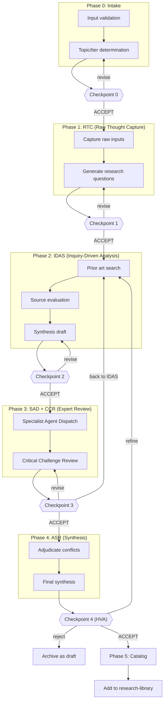

# Research Runbook v1.0

**Purpose:** Transform raw research inputs (questions, notes, corpus) into a **validated, cataloged research artifact** in the Praxis research-library.

**Relationship to PKDP:** This runbook operationalizes the PKDP methodology (see `praxis-ai/docs/guides/pkdp.md`) for human-AI research sessions.

**Relationship to IRR:** This is the research counterpart to `issue-refinement-runbook.md`. IRR produces GitHub issues; this runbook produces research-library artifacts.

**Changelog:**

- v1.0: Initial version — clean-slate design based on IRR patterns and PKDP methodology

---

## Quick Reference



### Checkpoints (STOP POINTS)

| Checkpoint | Shows | Proceeds to |
|------------|-------|-------------|
| 0 | Topic, tier, prior art check | RTC |
| 1 | `1.10-rtc-questions.md` | IDAS |
| 2 | `2.20-idas-synthesis.md` | SAD/CCR |
| 3 | `3.20-ccr-notes.md` | ASR |
| 4 (HVA) | `4.10-asr-synthesis.md` | Cataloging |

### Risk Tiers

| Tier | Stages | When to Use |
|------|--------|-------------|
| 0 | RTC → IDAS | Quick exploration, low stakes |
| 1 | RTC → IDAS → SAD → ASR | Standard research |
| 2 | RTC → IDAS → SAD → CCR → ASR | Important decisions, contested topics |
| 3 | RTC → IDAS → SAD → CCR → ASR → HVA | Foundational research, high stakes |

**Default tier: 2** (unless human specifies otherwise)

---

## Prerequisites

This runbook supports two modes:
- **CLI mode (recommended):** Requires `praxis` CLI with research and library commands
- **Manual mode (fallback):** Works without CLI using bash commands

### Version Check

```bash
praxis --version  # Requires >= 0.1.0
praxis library --help
praxis research --help
```

If CLI commands are not available, the runbook includes manual fallback instructions inline.

---

## Session Contract

- **Mode:** Active session logging in working folder
- **Working folder:** `_workshop/5-active/3-forge/<slug>/` (via symlink)
- **Stage management:** All transitions via `steward stage <slug> <stage>` commands
- **Output:** Research artifact in `praxis-ai/research-library/{topic}/`
- **Non-decisional:** This runbook produces knowledge, not commitments
- **Approval:** Semantic acceptance required at checkpoints

---

## Artifact Naming Convention

All artifacts use stable ordering prefixes: `P.SS-<name>.md`

- `P` = phase number (0–4, then 9 for final)
- `SS` = step number (00–99, use tens: 10, 20, 30...)

**Never renumber existing artifacts.** If inserting, use an unused `SS` value.

### Standard Artifacts

| Artifact | Purpose |
|----------|---------|
| `0.10-research-log.md` | Trace of what was read + what changed |
| `0.20-decisions.md` | Key decisions + alternatives considered |
| `0.30-prior-art-check.md` | Research-library precheck results |
| `1.10-rtc-questions.md` | Refined research questions |
| `1.20-rtc-raw-capture.md` | Raw inputs, notes, quotes |
| `2.10-idas-sources.md` | Source list with evaluations |
| `2.20-idas-synthesis.md` | Draft synthesis (pre-expert review) |
| `3.10-sad-dispatch.md` | Specialist assignments and outputs |
| `3.20-ccr-notes.md` | Critical challenge outputs |
| `4.10-asr-synthesis.md` | Final synthesis (post-adjudication) |
| `9.10-research-artifact.md` | Final artifact for research-library |
| `9.20-catalog-update.md` | CATALOG.md update instructions |
| `9.30-runbook-retrospective.md` | Session retrospective |

---

## Phase 0: Intake & Prior Art Check

### Required Inputs

The agent must determine:

1. **Research topic/question:** What are we researching?
2. **Risk tier:** 0, 1, 2, or 3 (default: 2)
3. **Starting input:** One of:
   - A single file (notes, question, corpus)
   - A folder of files (multiple related inputs)
   - An existing workshop item (already in `_workshop/`)
   - A one-sentence research question (no files)

### Slug Validation Loop

Same as IRR:

**Step 1: Calculate proposed slug**

Derive a slug from the input:
- From filename: `my-research-question.md` → `my-research-question`
- Strip numeric prefixes (e.g., `12-` prefix)
- Apply slug rules (kebab-case, directory-safe)

**Step 2: Slug approval loop**

```
Proposed slug: <slug>

Accept this slug? (Enter to accept, or type alternative)
```

**Step 3: Intake to workshop**

```bash
steward intake <path/to/input> --slug <approved-slug>
steward stage <slug> forge
```

Working folder: `_workshop/5-active/3-forge/<slug>/`

### Prior Art Check

**Mandatory step:** Search research-library for relevant prior work.

```bash
# CLI mode (recommended)
praxis library search --keyword "<topic-keywords>"
# Optionally filter by topic:
praxis library search --keyword "<topic-keywords>" --topic "<topic>"

# Manual fallback
# grep -i "<topic-keywords>" $PRAXIS_HOME/praxis-ai/research-library/CATALOG.md
```

Present findings:

```
══════════════════════════════════════════════════════════
 PRIOR ART CHECK
══════════════════════════════════════════════════════════

Topic: <topic>
Keywords searched: <keywords>

Related artifacts found:
- [id] <title> — Consensus: <rating> — Date: <date>
  Relevance: <brief note on how it relates>

- (none found)

Recommendation:
- [ ] Build on existing research (cite and extend)
- [ ] Fill a gap (no prior coverage)
- [ ] Supersede existing (update with new findings)
══════════════════════════════════════════════════════════
```

Write results to `0.30-prior-art-check.md`.

### Checkpoint 0 — Confirm Scope

```
AskUserQuestion:
  question: "Proceed with this research scope?"
  header: "Checkpoint 0"
  options:
    - label: "Accept"
      description: "Proceed to RTC with this topic and tier"
    - label: "Adjust tier"
      description: "Change risk tier (0-3)"
    - label: "Revise"
      description: "Adjust topic/scope"
```

---

## Phase 1: RTC (Raw Thought Capture)

### Capture Raw Inputs

1. Read all input files
2. Extract key points, quotes, questions, assumptions
3. Write raw capture to `1.20-rtc-raw-capture.md`

### Generate Research Questions

Transform raw inputs into clear research questions:

1. **Primary question:** The main thing we're trying to answer
2. **Sub-questions:** Supporting questions that inform the primary
3. **Non-questions:** What this research explicitly won't address

Write to `1.10-rtc-questions.md`:

```markdown
# Research Questions

## Primary Question

<single clear question>

## Sub-Questions

1. <sub-question>
2. <sub-question>
3. <sub-question>

## Out of Scope

- <what we're NOT researching>
- <what we're NOT researching>

## Success Criteria

- What would "answered" look like?
- What evidence standard applies?
```

### Checkpoint 1 — Approve Research Questions

```
══════════════════════════════════════════════════════════
 CHECKPOINT 1: Approve Research Questions
══════════════════════════════════════════════════════════

Draft: <working-folder>/1.10-rtc-questions.md

Primary question: <question>
Sub-questions: <N>
Risk tier: <tier>

Changes since intake:
- [List what was clarified/refined]
══════════════════════════════════════════════════════════
```

```
AskUserQuestion:
  question: "Proceed to IDAS with these research questions?"
  header: "Checkpoint 1"
  options:
    - label: "Accept"
      description: "Proceed to inquiry-driven analysis"
    - label: "Revise"
      description: "Refine questions"
```

---

## Phase 2: IDAS (Inquiry-Driven Analytical Synthesis)

### Source Gathering

1. **Web search:** Use WebSearch for authoritative sources
2. **Internal search:** Search codebase, specs, existing research
3. **Evaluate sources:** Rate each source's authority and relevance

Write to `2.10-idas-sources.md`:

```markdown
# Sources

## Web Sources

| # | Title | URL | Authority | Relevance | Notes |
|---|-------|-----|-----------|-----------|-------|
| 1 | ... | ... | High/Med/Low | High/Med/Low | ... |

## Internal Sources

| # | Path | Type | Relevance | Notes |
|---|------|------|-----------|-------|
| 1 | ... | spec/research/code | High/Med/Low | ... |

## Source Evaluation

- Total sources: <N>
- High authority: <N>
- High relevance: <N>
- Coverage gaps: <any topics with weak sourcing>
```

### Draft Synthesis

Synthesize findings into a draft:

1. **First Principles:** What foundational concepts apply?
2. **Findings:** What do the sources say?
3. **Consensus:** Where do sources agree?
4. **Conflicts:** Where do sources disagree?
5. **Gaps:** What's not covered in the sources?

Write to `2.20-idas-synthesis.md`:

```markdown
# IDAS Synthesis (Draft)

## Executive Summary

- <bullet 1>
- <bullet 2>
- <bullet 3>

## First Principles

<foundational concepts that apply>

## Findings

### <Topic 1>

<findings with inline citations [1], [2]>

### <Topic 2>

<findings with inline citations>

## Consensus Areas

<where sources agree>

## Conflicts / Tensions

<where sources disagree, note both positions>

## Gaps / Unknowns

<what the sources don't cover>

## Preliminary Consensus Rating

<High/Medium/Low — with justification>
```

### Checkpoint 2 — Approve IDAS Synthesis

**For Tier 0:** This is the final checkpoint. Proceed directly to cataloging.

**For Tier 1+:** Continue to SAD/CCR.

```
══════════════════════════════════════════════════════════
 CHECKPOINT 2: Approve IDAS Synthesis
══════════════════════════════════════════════════════════

Draft: <working-folder>/2.20-idas-synthesis.md

Sources: <N> (High authority: <N>)
Key findings: <summary>
Preliminary consensus: <rating>

══════════════════════════════════════════════════════════
```

```
AskUserQuestion:
  question: "Proceed to expert review?"
  header: "Checkpoint 2"
  options:
    - label: "Accept"
      description: "Proceed to SAD/CCR"
    - label: "Skip to ASR (Tier 1)"
      description: "Skip CCR, go directly to synthesis"
    - label: "Revise"
      description: "Refine synthesis"
```

---

## Phase 3: SAD + CCR (Expert Review)

### SAD (Specialist Agent Dispatch)

For Tier 1+, dispatch specialist reviewers based on topic:

| Topic Type | Specialists |
|------------|-------------|
| Methodology | Epistemologist, Domain Expert |
| Technical | Architect, Domain Expert |
| Process | Process Engineer, Practitioner |
| Foundational | Philosopher, Historian |

Write to `3.10-sad-dispatch.md`:

```markdown
# Specialist Dispatch

## Specialists Assigned

1. **<Role>**: Focus on <aspect>
2. **<Role>**: Focus on <aspect>

## Specialist Outputs

### <Role 1>

<findings, concerns, suggestions>

### <Role 2>

<findings, concerns, suggestions>
```

### CCR (Critical Challenge Review)

For Tier 2+, run adversarial review:

**Red Team focus:**
- Challenge key claims
- Find logical gaps
- Identify missing perspectives
- Surface failure modes
- Question source quality

Write to `3.20-ccr-notes.md`:

```markdown
# Critical Challenge Review

## Challenges

| # | Claim Challenged | Challenge | Severity | Resolution |
|---|------------------|-----------|----------|------------|
| 1 | ... | ... | High/Med/Low | Addressed/Deferred/Dismissed |

## Missing Perspectives

- <perspective not represented>

## Source Quality Concerns

- <any issues with sources>

## Failure Modes Identified

- <potential failure mode>

## Verdict

[ ] PASS — Ready for synthesis
[ ] REVISE — Address challenges before synthesis
[ ] ESCALATE — Fundamental issues, needs human decision
```

### Checkpoint 3 — Approve Expert Review

```
══════════════════════════════════════════════════════════
 CHECKPOINT 3: Approve Expert Review
══════════════════════════════════════════════════════════

SAD: <N specialists>
CCR: <N challenges> (High: <N>, Addressed: <N>)

Verdict: <PASS/REVISE/ESCALATE>

Key challenges:
- <challenge 1>
- <challenge 2>
══════════════════════════════════════════════════════════
```

```
AskUserQuestion:
  question: "Proceed to final synthesis?"
  header: "Checkpoint 3"
  options:
    - label: "Accept"
      description: "Proceed to ASR"
    - label: "Back to IDAS"
      description: "Return to Phase 2 for more research"
    - label: "Revise"
      description: "Address specific challenges"
```

---

## Phase 4: ASR (Adjudicated Synthesis & Resolution)

### Adjudicate Conflicts

For each conflict identified in IDAS or CCR:

1. State both positions
2. Evaluate evidence for each
3. Make adjudication decision with rationale
4. Note if consensus is high/medium/low for that point

### Final Synthesis

Produce the final artifact draft in `4.10-asr-synthesis.md`:

```markdown
# <Title>

<!--
metadata:
  id: <topic>-<slug>-<YYYY-MM-DD>
  title: <title>
  date: <YYYY-MM-DD>
  author: researcher
  status: review
  topic: <topic>
  also_relevant: [<secondary topics>]
  keywords: [<keyword1>, <keyword2>, ...]
  consensus: <high|medium|low>
  epistemic_standard: <quick|standard|thorough>
  sources_count: <N>
  timebox: <X minutes>
  supersedes: <null or prior-id>
  related: [<related-ids>]
  reviewed_by: [<reviewers>]
  review_date: <YYYY-MM-DD>
-->

## Executive Summary

- <bullet 1>
- <bullet 2>
- <bullet 3>
- ...

## Consensus Rating

**<High|Medium|Low>**: <justification>

## Body

### First Principles

<foundational concepts>

### Findings

<main findings with citations>

### Dissenting Views / Caveats

<alternative perspectives, limitations>

### Known Limitations

<what this research doesn't cover or can't conclude>

## Reusable Artifacts

<tables, checklists, schemas that others can use>

## Sources

1. <source with URL if applicable>
2. ...

---

## Review Notes

### CCR Review (<date>)

**Verdict**: <verdict>

**Issues identified and addressed**:

| Issue | Severity | Resolution |
|-------|----------|------------|
| ... | ... | ... |

### Synthesis Review (<date>)

**Verdict**: <verdict>

**Conflicts resolved**:
- ...

---

_Generated by researcher_
_Reviewed by <reviewers>_
```

### Checkpoint 4 — HVA (Human Validation & Acceptance)

This is the final human gate.

```
══════════════════════════════════════════════════════════
 CHECKPOINT 4: Human Validation & Acceptance (HVA)
══════════════════════════════════════════════════════════

Final Artifact: <working-folder>/4.10-asr-synthesis.md

Title: <title>
Topic: <topic>
Consensus: <rating>
Sources: <N>

Executive summary:
- <bullet 1>
- <bullet 2>
- <bullet 3>

Ready for cataloging in research-library?
══════════════════════════════════════════════════════════
```

```
AskUserQuestion:
  question: "Accept this research artifact?"
  header: "HVA"
  options:
    - label: "Accept"
      description: "Catalog in research-library"
    - label: "Refine"
      description: "Return to IDAS for more research"
    - label: "Reject"
      description: "Archive as draft (not cataloged)"
```

---

## Phase 5: Catalog (on HVA Accept)

### Prepare Final Artifact

1. Copy `4.10-asr-synthesis.md` to `9.10-research-artifact.md`
2. Update metadata:
   - `status: approved`
   - Add `approved_by: human`
   - Add `approved_date: <date>`

### Move to Research Library

```bash
# CLI mode (recommended) — automatic cataloging on approve
praxis research approve --rationale "ready for cataloging"
# This copies the artifact to research-library and updates CATALOG.md automatically

# Manual fallback
# topic="<topic>"
# slug="<artifact-slug>"
# target="$PRAXIS_HOME/praxis-ai/research-library/${topic}/${slug}.md"
# cp <working-folder>/9.10-research-artifact.md "$target"
```

### Update CATALOG.md

When using CLI mode, CATALOG.md is updated automatically by `praxis research approve`.

For manual mode, generate update instructions in `9.20-catalog-update.md`:

```markdown
# CATALOG.md Update

## Quick Reference Table

Add row:
| [<id>](<path>) | <title> | <topic> | <consensus> | <date> |

## By Topic Section

Add under "### <Topic>":
| [<id>](<path>) | <title> | <consensus> | <keywords> |

## Keyword Index

Add entries for each keyword:
### <keyword>
- [<title>](<path>)

## Recently Added

Add row:
| <date> | [<title>](<path>) | <topic> |
```

### Handoff to Archive

```bash
# Move from forge to archive
steward stage <slug> archive
```

### Print Completion Summary

```
══════════════════════════════════════════════════════════
 RESEARCH COMPLETE
══════════════════════════════════════════════════════════

Artifact: <id>
Title: <title>
Location: research-library/<topic>/<slug>.md

Cataloged: Yes
  - CATALOG.md updated
  - Keywords indexed: <N>

Next steps:
1. Review CATALOG.md update
2. Commit changes to praxis-ai repo

══════════════════════════════════════════════════════════
```

---

## Definition of Done

A research artifact is complete when:

- [ ] Clear research question is answered
- [ ] Findings supported by cited sources
- [ ] Consensus rating justified
- [ ] Dissenting views/caveats documented
- [ ] Known limitations stated
- [ ] Metadata complete (id, topic, keywords, etc.)
- [ ] Added to CATALOG.md (all sections)
- [ ] Working folder archived

---

## Resuming a Prior Session

When picking up work from a previous session:

1. **Find item and current stage:**
   ```bash
   steward list | grep "<slug>"
   ```
2. **If in shelf, resume to forge:**
   ```bash
   steward stage <slug> forge
   ```
3. Read all numbered files in the working folder in order (0.xx, 1.xx, 2.xx, etc.)
4. Check `0.20-decisions.md` for prior decisions still in force
5. Identify the last completed checkpoint and resume at the next phase
6. Update `0.10-research-log.md` with "Session resumed" entry

---

## Appendix: Runbook Retrospective

After completing a research session, conduct a brief retrospective.

### Session Stats (Print to Console)

```
══════════════════════════════════════════════════════════
 SESSION STATS
══════════════════════════════════════════════════════════

Research: <title>
Artifact ID: <id>

┌────────────────────────────┬───────────────────┐
│ Metric                     │ Value             │
├────────────────────────────┼───────────────────┤
│ Risk tier                  │ [0/1/2/3]         │
│ Sources consulted          │ [N]               │
│ High-authority sources     │ [N]               │
│ CCR challenges             │ [N]               │
│ Challenges addressed       │ [N]               │
│ Consensus rating           │ [High/Med/Low]    │
└────────────────────────────┴───────────────────┘

Phases used: [0, 1, 2, 3, 4]
Checkpoints passed: [N]

══════════════════════════════════════════════════════════
```

### Retrospective Template

Write to `9.30-runbook-retrospective.md`:

```markdown
# Runbook Retrospective

## Session Summary

- Research: <title>
- Artifact: <id>
- Tier: <tier>
- Sources: <N>
- Consensus: <rating>

## What Worked Well

-

## Friction Points

-

## Suggested Improvements

-
```

---

## Appendix: Relationship to Other Runbooks

| Runbook | Input | Output | When to Use |
|---------|-------|--------|-------------|
| **Research Runbook** (this) | Question, notes, corpus | Research-library artifact | Standalone research |
| **Issue Refinement Runbook** | Feature idea | GitHub issue | Feature/bug tickets |
| **IRR Research Companion** | (modifier for IRR) | Research-flavored issue | Research *tickets* |
| **PKDP Companion** | (modifier for IRR) | Knowledge gap spawn | Gap detection during IRR |

### When to Use What

**Use Research Runbook when:**
- Goal is a knowledge artifact (not a ticket)
- Output goes to research-library
- Research is the primary activity

**Use IRR + Research Companion when:**
- Goal is a GitHub issue for research work
- Research is tracked as a ticket
- Need sprint-planning integration

**Use IRR + PKDP Companion when:**
- Doing feature refinement
- Knowledge gap discovered mid-refinement
- Need to spawn research as side-effect

---

## Appendix: Research Artifact Template

For reference, the target artifact structure:

```markdown
# <Title>

<!--
metadata:
  id: <topic>-<slug>-<YYYY-MM-DD>
  title: <title>
  date: <YYYY-MM-DD>
  author: researcher
  status: approved
  topic: <topic>
  also_relevant: []
  keywords: []
  consensus: <high|medium|low>
  sources_count: <N>
  related: []
  supersedes: null
  reviewed_by: []
  review_date: <date>
  approved_by: human
  approved_date: <date>
-->

## Executive Summary

-

## Consensus Rating

**<Rating>**: <justification>

## Body

### First Principles

### Findings

### Dissenting Views / Caveats

### Known Limitations

## Reusable Artifacts

## Sources

1.

---

## Review Notes

### CCR Review (<date>)

### Synthesis Review (<date>)

---

_Generated by researcher_
_Approved: <date>_
```
