# Spec-to-Repo Graduation Runbook v1.0

**Purpose:** Graduate a superpowers-born project (spec + plan + worktree code) into a standalone repository with its own identity, naming, and lifecycle.

**Relationship to Superpowers:** This is the **exit ramp** from the superpowers brainstorm → spec → plan → implement cycle. It triggers when a project has proven itself in a worktree and is ready for standalone development.

**Relationship to Praxis:** Graduated projects get a `praxis.yaml` and follow Praxis domain conventions (code, create, write, learn).

**Changelog:**

- v1.0: Initial version — designed during yt-brain graduation (first trial)

---

## Quick Reference

```mermaid
flowchart TD
    subgraph Phase0["Phase 0: Readiness"]
        A[Tests pass in worktree?] --> B[Target repo exists + in .mrconfig?]
        B --> C[Naming decisions: CLI, package, config path]
        C --> D[Domain + subtype decided]
    end

    D --> E{{"Checkpoint 0"}}
    E -->|revise| C
    E -->|ACCEPT| F

    subgraph Phase1["Phase 1: Repo Setup"]
        F[Create praxis.yaml] --> G[Create CLAUDE.md]
        G --> H[Create README.md]
    end

    H --> I{{"Checkpoint 1"}}
    I -->|revise| F
    I -->|ACCEPT| J

    subgraph Phase2["Phase 2: Code Migration"]
        J[Copy source tree] --> K[Rename directories]
        K --> L[Rename imports + references]
        L --> M[Update pyproject.toml]
    end

    M --> N{{"Checkpoint 2"}}
    N -->|revise| L
    N -->|ACCEPT| O

    subgraph Phase3["Phase 3: Docs Migration"]
        O[Move spec to target repo] --> P[Move plan to target repo]
        P --> Q[Update path references]
    end

    Q --> R{{"Checkpoint 3"}}
    R -->|revise| Q
    R -->|ACCEPT| S

    subgraph Phase4["Phase 4: Verification"]
        S[uv sync] --> T[Run tests]
        T --> U[CLI smoke test]
        U --> V[Grep for leftover old names]
    end

    V --> W{{"Checkpoint 4"}}
    W -->|fix issues| S
    W -->|ACCEPT| X

    subgraph Phase5["Phase 5: Cleanup"]
        X[Delete worktree] --> Y[Delete feature branch]
        Y --> Z[Delete bin/ wrapper]
        Z --> AA[Delete workspace spec/plan]
        AA --> AB[Commit workspace cleanup]
    end

    AB --> AC{{"Checkpoint 5"}}
    AC -->|ACCEPT| AD[Initial commit + push in new repo]
```



### Checkpoints (STOP POINTS)

| Checkpoint | Shows | Proceeds to |
|------------|-------|-------------|
| 0 | Naming decisions, domain/subtype, readiness confirmation | Repo Setup |
| 1 | praxis.yaml, CLAUDE.md, README.md in target repo | Code Migration |
| 2 | Source tree copied + renamed, pyproject.toml updated | Docs Migration |
| 3 | Spec + plan moved, internal references updated | Verification |
| 4 | Tests pass, CLI works, no leftover old names | Cleanup |
| 5 | Workspace clean, worktree/branch deleted | Initial commit + push |

---

## When to Graduate

A project is ready for graduation when:

- At least one implementation phase is complete with passing tests
- The project has its own CLI, data, and/or config (standalone identity)
- A GitHub repo has been created for it
- Continued development in a worktree would accumulate rename/migration debt

**Graduate early.** The longer code lives in a worktree with its workspace-era naming, the more painful the migration becomes.

---

## Phase 0: Readiness

### Confirm Prerequisites

1. **Tests pass** in the worktree:
   ```bash
   cd .worktrees/<name>/extensions/<name>/
   uv run pytest
   ```

2. **Target repo exists** and is cloned into the workspace:
   ```bash
   ls projects/<domain>/<new-name>/
   ```

3. **Target repo is in .mrconfig:**
   ```bash
   grep "<new-name>" .mrconfig
   ```

### Naming Decisions

Fill in this table before proceeding:

| Decision | Value |
|----------|-------|
| **CLI command** | `<new-name>` (e.g., `yt-brain`) |
| **Python package** | `<new_name>` (e.g., `yt_brain`) |
| **pyproject.toml name** | `<new-name>` (e.g., `yt-brain`) |
| **Config path** | `~/.config/<new-name>/` |
| **DB filename** | `<new-name>.db` |
| **Domain** | code / create / write / learn |
| **Subtype** | (domain-specific, e.g., skill, exploration) |
| **Lifecycle stage** | (e.g., execute, sustain) |

### Rename Mapping

Build the full rename mapping. Common patterns:

| Context | Old | New |
|---------|-----|-----|
| Source directory | `src/<oldpkg>/` | `src/<newpkg>/` |
| All imports | `from <oldpkg>.` / `import <oldpkg>` | `from <newpkg>.` / `import <newpkg>` |
| pyproject.toml name | `"<oldname>"` | `"<new-name>"` |
| pyproject.toml scripts | `<oldcli> = "<oldpkg>.cli:app"` | `<newcli> = "<newpkg>.cli:app"` |
| Config class | `<OldName>Config` | `<NewName>Config` |
| Config env var | `<OLDNAME>_CONFIG_DIR` | `<NEWNAME>_CONFIG_DIR` |
| Default config dir | `~/.config/praxis/<oldname>/` | `~/.config/<new-name>/` |
| DB filename | `<oldname>.db` | `<new-name>.db` |
| hatch build paths | `src/<oldpkg>` | `src/<newpkg>` |

### Checkpoint 0 — Confirm Graduation Scope

```
══════════════════════════════════════════════════════════
 CHECKPOINT 0: Readiness
══════════════════════════════════════════════════════════

Project: <old-name> → <new-name>
Source: .worktrees/<name>/extensions/<name>/
Target: projects/<domain>/<new-name>/

CLI: <new-cli>
Package: <new-pkg>
Config: ~/.config/<new-name>/
Domain: <domain> / <subtype>

Tests pass: [yes/no]
Target repo exists: [yes/no]
In .mrconfig: [yes/no]

Rename mapping: [N items]
══════════════════════════════════════════════════════════
```

Wait for ACCEPT before proceeding.

---

## Phase 1: Repo Setup

In the target repo, create the project skeleton.

### praxis.yaml

```yaml
domain: <domain>
subtype: <subtype>
stage: <stage>
privacy_level: personal
environment: Home
```

### CLAUDE.md

Adapt from the worktree's CLAUDE.md. Update:
- Project name and description
- File paths (no longer under `extensions/`)
- Remove any workspace-specific references

### README.md

Brief project description. Draw from the spec's Vision section.

### Checkpoint 1 — Confirm Repo Skeleton

```
══════════════════════════════════════════════════════════
 CHECKPOINT 1: Repo Skeleton
══════════════════════════════════════════════════════════

Files created:
- [ ] praxis.yaml
- [ ] CLAUDE.md
- [ ] README.md

Review each file before proceeding.
══════════════════════════════════════════════════════════
```

Wait for ACCEPT before proceeding.

---

## Phase 2: Code Migration

### Copy Source Tree

```bash
# Copy source, tests, migrations, pyproject.toml
cp -r .worktrees/<name>/extensions/<name>/src/ projects/<domain>/<new-name>/src/
cp -r .worktrees/<name>/extensions/<name>/tests/ projects/<domain>/<new-name>/tests/
cp -r .worktrees/<name>/extensions/<name>/migrations/ projects/<domain>/<new-name>/migrations/
cp .worktrees/<name>/extensions/<name>/pyproject.toml projects/<domain>/<new-name>/pyproject.toml
```

Adjust the list based on what the project actually has (not all projects have migrations, tests/features, etc.).

### Rename Source Directory

```bash
mv projects/<domain>/<new-name>/src/<oldpkg>/ projects/<domain>/<new-name>/src/<newpkg>/
```

### Rename All References

Apply the rename mapping from Phase 0 across all files. Use your editor or:

```bash
cd projects/<domain>/<new-name>/
# Find all files with old references
grep -r "<oldpkg>" src/ tests/ pyproject.toml
```

Then rename systematically:
1. **Imports** in all `.py` files: `from <oldpkg>.` → `from <newpkg>.`
2. **pyproject.toml**: name, scripts, build paths
3. **Config constants**: class names, env vars, default paths, DB filename
4. **Test files**: any hardcoded references

### Checkpoint 2 — Confirm Code Migration

```
══════════════════════════════════════════════════════════
 CHECKPOINT 2: Code Migration
══════════════════════════════════════════════════════════

Source dir renamed: src/<oldpkg>/ → src/<newpkg>/
Files with old references remaining: [N]

Quick check:
  grep -r "<oldpkg>" src/ tests/ pyproject.toml

Imports resolve: [yes/no]
══════════════════════════════════════════════════════════
```

Wait for ACCEPT before proceeding.

---

## Phase 3: Docs Migration

### Move Spec and Plan

```bash
mkdir -p projects/<domain>/<new-name>/docs/design/
mv docs/superpowers/specs/<date>-<old>-design.md projects/<domain>/<new-name>/docs/design/spec.md
mv docs/superpowers/plans/<date>-<old>-phase1.md projects/<domain>/<new-name>/docs/design/phase1-plan.md
```

### Update Internal References

In both spec and plan files:
- Replace `extensions/<old>/` paths with project-relative paths
- Replace `~/.config/praxis/<old>/` with `~/.config/<new-name>/`
- Replace any workspace-specific paths
- Update the project name throughout

### Checkpoint 3 — Confirm Docs Migration

```
══════════════════════════════════════════════════════════
 CHECKPOINT 3: Docs Migration
══════════════════════════════════════════════════════════

Moved:
- [ ] spec → docs/design/spec.md
- [ ] plan → docs/design/phase1-plan.md

Path references updated: [yes/no]
Old name references remaining: [N]

Quick check:
  grep -ri "<oldname>" docs/
══════════════════════════════════════════════════════════
```

Wait for ACCEPT before proceeding.

---

## Phase 4: Verification

### Install and Test

```bash
cd projects/<domain>/<new-name>/
uv sync
uv run pytest
uv run <new-cli> --help
```

### Check for Leftover References

```bash
grep -r "<oldpkg>" src/ tests/ migrations/
grep -r "<oldname>" src/ tests/ pyproject.toml CLAUDE.md
```

Any hits here must be addressed before proceeding.

### Checkpoint 4 — All Green

```
══════════════════════════════════════════════════════════
 CHECKPOINT 4: Verification
══════════════════════════════════════════════════════════

uv sync: [pass/fail]
pytest: [pass/fail] ([N] tests)
CLI --help: [pass/fail]
Leftover old references: [0]
══════════════════════════════════════════════════════════
```

Wait for ACCEPT before proceeding.

---

## Phase 5: Cleanup

### Remove Workspace Artifacts

```bash
# Remove worktree
git worktree remove .worktrees/<name>

# Delete feature branch (local)
git branch -d feature/<name>-phase1

# Delete feature branch (remote)
git push origin --delete feature/<name>-phase1

# Delete bin wrapper (if exists)
rm bin/<oldcli>

# Delete workspace spec/plan (already moved)
rm docs/superpowers/specs/<date>-<old>-design.md
rm docs/superpowers/plans/<date>-<old>-phase1.md
```

### Commit Workspace Cleanup

```bash
git add -A
git commit -m "Remove <old-name> workspace artifacts — graduated to projects/<domain>/<new-name>"
```

### Checkpoint 5 — Workspace Clean

```
══════════════════════════════════════════════════════════
 CHECKPOINT 5: Workspace Cleanup
══════════════════════════════════════════════════════════

Removed:
- [ ] Worktree: .worktrees/<name>/
- [ ] Branch: feature/<name>-phase1
- [ ] Remote branch: origin/feature/<name>-phase1
- [ ] Bin wrapper: bin/<oldcli>
- [ ] Spec: docs/superpowers/specs/...
- [ ] Plan: docs/superpowers/plans/...

Workspace committed: [yes/no]
══════════════════════════════════════════════════════════
```

Wait for ACCEPT before proceeding.

---

## Final: Initial Commit + Push

In the target repo:

```bash
cd projects/<domain>/<new-name>/
git add -A
git commit -m "Initial commit — graduated from praxis-workspace superpowers"
git push -u origin main
```

### Completion Summary

```
══════════════════════════════════════════════════════════
 GRADUATION COMPLETE
══════════════════════════════════════════════════════════

Project: <old-name> → <new-name>
Repo: projects/<domain>/<new-name>/
Domain: <domain> / <subtype>

Tests: [N] passing
CLI: <new-cli> --help works
Config: ~/.config/<new-name>/

Workspace: cleaned (worktree, branch, bin, docs removed)

Next steps:
1. Verify with `mr status`
2. Continue development in the new repo
══════════════════════════════════════════════════════════
```

---

## Definition of Done

A graduation is complete when:

- [ ] Target repo has praxis.yaml, CLAUDE.md, README.md
- [ ] All source code migrated and renamed
- [ ] All tests pass in the new repo
- [ ] CLI works with the new name
- [ ] Spec and plan moved to new repo's docs/design/
- [ ] No leftover old-name references in the new repo
- [ ] Worktree removed from workspace
- [ ] Feature branch deleted (local + remote)
- [ ] Workspace spec/plan files deleted
- [ ] Workspace bin wrapper deleted
- [ ] Workspace cleanup committed
- [ ] New repo committed and pushed

---

## Relationship to Other Runbooks

| Runbook | Input | Output | When to Use |
|---------|-------|--------|-------------|
| **Spec Graduation** (this) | Superpowers spec + worktree code | Standalone repo | Project ready for independence |
| **Research Runbook** | Question, notes | Research-library artifact | Standalone research |
| **Issue Refinement Runbook** | Feature idea | GitHub issue | Feature/bug tickets |

### Where This Fits in the Superpowers Cycle

```
brainstorm → spec → plan → implement (worktree) → [THIS RUNBOOK] → standalone repo
```

Use this runbook when a project has proven itself in the worktree and is ready for its own repository and identity.
